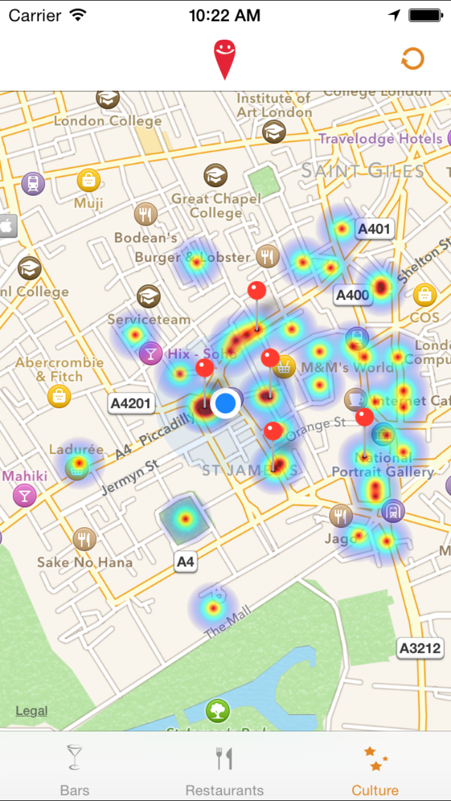

# Happy Places

## Introduction

Application développée lors des [Happy Hacking Days 2014](http://www.happyhackingdays.com/).

Permet de générer une [HeatMap](http://en.wikipedia.org/wiki/Heat_map) des endroits avec le plus de check-ins sur Foursquare.

Le rayon de recherche est limité à 20km.


## Installation

Nécessite `cocoapods` pour les frameworks externes.

Remplacer dans `FoursquareManager.m` :

```objective-c
NSString *FOURSQUARE_CLIENT_ID = @"XXXXXXXXXXXXXXXXXXXXXXXXXXXXXXXXXXXXXXXXXXXXXXXXXX";
NSString *FOURSQUARE_CLIENT_SECRET = @"XXXXXXXXXXXXXXXXXXXXXXXXXXXXXXXXXXXXXXXXXXXXXXXXXX";
```

Par vos `client_id` et `client_secret` optenus sur [Foursquare Developer](https://developer.foursquare.com/).

## Licence

```
Copyright 2013 Benjamin Digeon & Lucie Castier

Licensed under the Apache License, Version 2.0 (the "License");
you may not use this file except in compliance with the License.
You may obtain a copy of the License at

   http://www.apache.org/licenses/LICENSE-2.0

Unless required by applicable law or agreed to in writing, software
distributed under the License is distributed on an "AS IS" BASIS,
WITHOUT WARRANTIES OR CONDITIONS OF ANY KIND, either express or implied.
See the License for the specific language governing permissions and
limitations under the License.
```